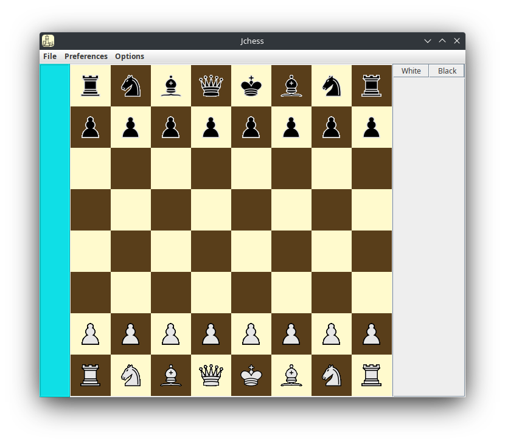

# JChess

A simple chess game made in Java with Swing interface.

## Introduction

This is a project to test my skills using Java, improving my skills in inheritance, polymorphism, casting, collections, using unit tests with JUnit, and also using GUI with Swing.

## Screenshot

## Features

 - You can play against the AI by setting up the game in the Setup game section.
 - You can use highlight for your moves in the Preferences menu.
 - You can change the board position using the "Flip Board" option in the Preferences menu.

## What I learned

 - I learned how to structure my project in different folders and use conventions for Java projects.
 - I learned how to handle classes, immutability, their access modifiers, and their importance, as well as how to declare my variables as constants.
 - I was able to handle abstract classes, polymorphism, and casting and understand how they are used.
 - I learned design patterns such as Singleton and Builders.
 - I learned how to make simple unit tests to test program functions.
 - I learned how to make an AI with a Minimax model with alpha-beta pruning.
 - I improved my skills in debugging and interpreting errors.
## TODO

 - Improve AI using movement patterns based on book moves.
 - Implement PGN.
 - Implement a button to reset the game.
 - Implement online play.
 - Fix GUI bugs.
 - Improve GUI interactions.
 - Improve the engine for StaleMate options.
## Contact
 - [LinkedIn](https://www.linkedin.com/in/jonathan-mauricio-cifuentes-bar%C3%B3n-1094b6b7/)

